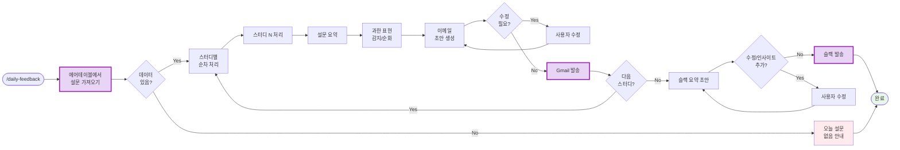

# 나의 워크샵 스킬 설계서

> 📋 **이 설계서는 [사전설문응답.md](사전설문응답.md) 인터뷰를 바탕으로 작성되었습니다.**

## 목차
- [0. 선언](#0-선언)
- [한눈에 보기](#한눈에-보기) (외부 연동 + 워크플로 시각화)
- [Core (필수)](#core-필수)
  - [1. 언제 쓰나요?](#1-언제-쓰나요)
  - [2. 사용법](#2-사용법)
  - [3. 입력/출력 명세](#3-입력출력-명세)
  - [4. 범위](#4-범위)
  - [5. 데이터/도구/권한](#5-데이터도구권한)
  - [6. 실패/예외 처리](#6-실패예외-처리)
  - [7. 대화 시나리오](#7-대화-시나리오)
  - [8. 테스트 & 완료 기준](#8-테스트--완료-기준)
- [Optional](#optional-외부-api-연동)
  - [외부 API 연동](#optional-외부-api-연동)
  - [다단계 워크플로우](#optional-다단계-워크플로우)
- [나중에 더 발전시킬 아이디어](#나중에-더-발전시킬-아이디어)

---

## 0. 선언

- **스킬 이름**: daily-feedback
- **한 줄 설명**: 5개 스터디 설문을 취합하여 스터디장 이메일 + 슬랙 요약까지 자동화
- **만드는 사람**: 커뮤니티 매니저 (AI 스터디 운영)
- **스킬 유형**: [x] 다단계 워크플로우  [x] 외부 API
- **MVP 목표**: "에어테이블 설문을 읽고, 스터디별 이메일 초안 생성 + 슬랙 요약 초안까지 자동 생성"

---

## 한눈에 보기

### 외부 연동

| 서비스 | 용도 | 연동 방식 | 복잡도 |
|--------|------|----------|--------|
| 에어테이블 | 설문 데이터 읽기 | MCP | 쉬움 |
| Gmail | 스터디장 이메일 발송 | 스크립트 | 중간 |
| 슬랙 | 전체 요약 공유 | 스크립트 (웹훅) | 쉬움 |

> 📁 상세 설정 가이드: [연동가이드/](연동가이드/) 폴더 참조

### 워크플로 시각화

---

## Core (필수)

### 1. 언제 쓰나요?

**대표 상황**:
매일 아침, 전날 진행된 5개 스터디의 무기명 설문 응답을 처리해야 할 때.
설문을 읽고 → 과한 표현 순화 → 스터디장에게 이메일 → 전체 요약을 슬랙에 공유하는 루틴.

**왜 필요한가** (불편/비용/시간):
- 매일 30분 이상 소요
- 주 5일 = 2시간 30분+
- 단순 반복이지만 빠뜨리면 안 되는 중요한 업무

### 2. 사용법

**이렇게 부르면**:
- `/daily-feedback`
- "오늘 피드백 처리해줘"
- "스터디 설문 정리해줘"

**결과물 형태**: [x] 메시지  [ ] 파일  [ ] 링크/리포트  [ ] 기타

**결과물 예시**:
> **[스터디1] 이메일 초안**
>
> 안녕하세요 OO님, 이번 주도 스터디 운영 수고 많으셨어요!
>
> **설문 요약**: 전반적으로 만족스러웠다는 반응이 많았어요. (긍정 8, 보통 2)
>
> **눈여겨볼 피드백**: "진행 속도가 조금 빨랐으면 좋겠어요"
> → 혹시 다음 주에 속도 조절 계획이 있으신가요?
>
> **원본 설문 데이터**: (아래 첨부)
> ...

### 3. 입력/출력 명세

| 구분 | 내용 |
|------|------|
| **사용자 입력** | 없음 (자동으로 오늘 날짜 기준 설문 가져옴) |
| **필수 옵션** | 없음 |
| **선택 옵션** | 특정 날짜 지정 (예: "어제 피드백"), 특정 스터디만 처리 |
| **출력 규칙** | 스터디별 순차 처리, 이메일은 확인 후 발송, 슬랙도 확인 후 발송 |

### 4. 범위

**하는 것** (3개 이내):
1. 에어테이블에서 설문 데이터 읽어서 스터디별로 분류
2. 과한 표현 감지 및 순화 제안 + 스터디장 이메일 초안 생성
3. 전체 요약 슬랙 메시지 초안 생성

**안 하는 것** (2개 이내):
1. 자동 발송 (반드시 확인 후 수동 발송)
2. 인사이트/액션 아이템 작성 (커뮤니티 매니저가 직접 추가)

### 5. 데이터/도구/권한

| 항목 | 내용 |
|------|------|
| **읽는 데이터** | 에어테이블 설문 응답 (MCP로 직접 접근) |
| **쓰는 위치** | Gmail 발송, 슬랙 채널 발송 |
| **외부 서비스** | 에어테이블(MCP), Gmail(스크립트), 슬랙(웹훅) |
| **민감정보** | 에어테이블 API 키, Gmail 앱 비밀번호, 슬랙 웹훅 URL |

### 6. 실패/예외 처리

**예상되는 실패 상황**:
1. 에어테이블 연결 실패 (API 키 만료/잘못됨)
2. 오늘 날짜 설문이 없음 (스터디 쉬는 날)
3. Gmail 발송 실패 (앱 비밀번호 문제)

**실패 시 안내 원칙**:
- 연결 실패: "에어테이블 연결이 안 돼요. API 키 확인해주세요!"
- 데이터 없음: "오늘 들어온 설문이 없어요. 날짜를 확인하거나 '어제 피드백'으로 다시 시도해보세요."
- 발송 실패: "이메일 발송이 실패했어요. 초안은 저장해뒀으니 수동으로 보내실 수 있어요."

### 7. 대화 시나리오

**정상 케이스**:

**나**: "/daily-feedback"

**스킬**:
> 에어테이블에서 오늘(2/3) 설문 가져왔어요. 총 5개 스터디, 47개 응답이에요.
>
> ---
> **[스터디1: AI 기초반]** 처리할게요. (응답 12개)
>
> **설문 요약**: 긍정 9, 보통 2, 부정 1
>
> **순화 필요**: 1건
> - 원문: "진행자가 너무 느려서 답답했음"
> - 제안: "진행 속도가 조금 더 빨랐으면 좋겠어요"
>
> **이메일 초안**:
> (초안 내용...)
>
> 수정할 거 있으면 말씀해주세요. 괜찮으면 "보내"라고 해주세요!

**실패 케이스**:

**나**: "/daily-feedback"

**스킬**:
> 에어테이블 연결이 안 돼요 😅
>
> 확인해주세요:
> 1. MCP 설정이 되어 있나요?
> 2. API 키가 유효한가요?
>
> 설정 후 다시 시도해주세요!

### 8. 테스트 & 완료 기준

**테스트 체크리스트**:
- [ ] 에어테이블에서 오늘 설문 가져오기
- [ ] 스터디별 분류 정확한지 확인
- [ ] 과한 표현 감지 + 순화 제안 동작
- [ ] 이메일 초안 생성 (격려 멘트 + 요약 + raw 데이터)
- [ ] Gmail로 실제 발송
- [ ] 슬랙 요약 초안 생성
- [ ] 슬랙으로 실제 발송

**Done 기준**:
"5개 스터디 설문을 순차적으로 처리하고, 각 스터디장에게 이메일 발송 + 슬랙 요약 공유까지 완료. 확인/수정 단계 포함."

---

## Optional: 외부 API 연동

3개의 외부 서비스 연동이 필요합니다.

### B-1. 에어테이블 (Airtable)

| 항목 | 내용 |
|------|------|
| **연동 방식** | MCP (권장) |
| **필요한 credential** | Personal Access Token |
| **복잡도** | 쉬움 |
| **예상 설정 시간** | 10-15분 |

**설정 가이드 요약**:
1. https://airtable.com/create/tokens 에서 Personal Access Token 생성
2. 필요한 권한: `data.records:read` (설문 읽기용)
3. MCP 설정에 추가 (상세 가이드는 `연동가이드/airtable.md` 참조)

### B-2. Gmail

| 항목 | 내용 |
|------|------|
| **연동 방식** | 스크립트 (nodemailer) |
| **필요한 credential** | Gmail 앱 비밀번호 |
| **복잡도** | 중간 |
| **예상 설정 시간** | 15-20분 |

**설정 가이드 요약**:
1. Google 계정에서 2단계 인증 활성화
2. 앱 비밀번호 생성: https://myaccount.google.com/apppasswords
3. 환경변수에 저장 (상세 가이드는 `연동가이드/gmail.md` 참조)

### B-3. 슬랙 (Slack)

| 항목 | 내용 |
|------|------|
| **연동 방식** | 스크립트 (Incoming Webhook) |
| **필요한 credential** | Webhook URL |
| **복잡도** | 쉬움 |
| **예상 설정 시간** | 10분 |

**설정 가이드 요약**:
1. Slack 앱 생성: https://api.slack.com/apps
2. Incoming Webhooks 활성화
3. 채널 선택 후 Webhook URL 복사 (상세 가이드는 `연동가이드/slack.md` 참조)

---

> **참고**: 상세 가이드는 `연동가이드/` 폴더의 개별 파일을 확인하세요.

### 사전 준비 권장사항

| 서비스 | 사전 설정 | 이유 |
|--------|----------|------|
| 에어테이블 | **워크샵 전 필수** | MCP 설정 + 재시작 필요 |
| Gmail | 워크샵 전 권장 | 앱 비밀번호 발급에 시간 소요 |
| 슬랙 | 당일 가능 | 웹훅 설정 간단 |

**총 예상 사전 설정 시간**: 약 30-40분

---

## Optional: 다단계 워크플로우

**단계 목록**:
1. **데이터 수집** → 산출물: 스터디별 설문 응답 목록
2. **스터디별 처리 (x5)** → 산출물: 이메일 발송 완료
3. **전체 요약** → 산출물: 슬랙 메시지 발송 완료

**중단/재개 방법**:
- 스터디 처리 중 중단: "잠깐 멈춰" → 나중에 "이어서 해줘"
- 특정 스터디만 다시: "스터디3 다시 처리해줘"

---

## 나중에 더 발전시킬 아이디어

- [ ] 설문 응답 트렌드 분석 (주간/월간 비교)
- [ ] 자주 나오는 키워드 자동 추출
- [ ] 스터디장 응답 템플릿 커스터마이징
- [ ] 줌 녹화본 유튜브 업로드 자동화 연계

---

**워크샵 당일 이 설계서 가져오세요!**
